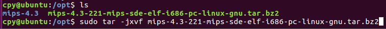
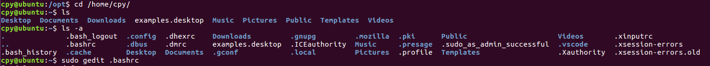
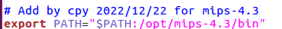
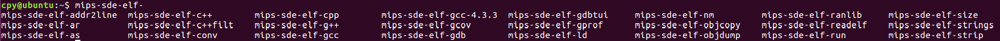
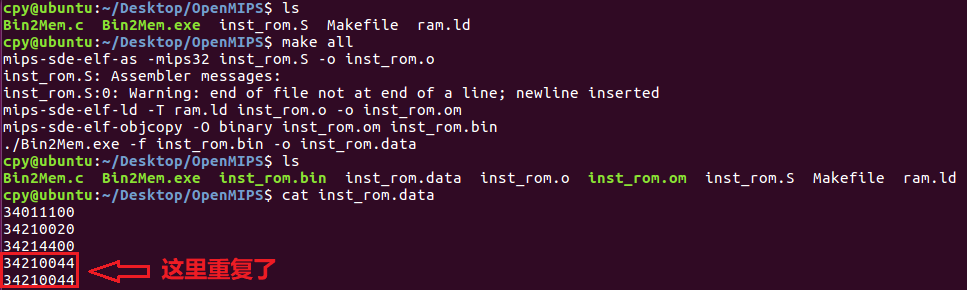

# OpenMIPS
用来记录学习《自己动手写CPU》的过程。

---
* [ToolKit](https://github.com/cpyhal3515/OpenMIPS/tree/main/ToolKit) 中主要包括编译 MIPS 指令的文件。
    * **Step1**：首先需要将 mips-4.3-221-mips-sde-elf-i686-pc-linux-gnu.tar.bz2 文件解压到 /opt/ 中。
    
    * **Step2**：之后打开用户主目录 Home 文件夹，通过 ls -a 指令找到隐藏的 .bashrc 文件，使用 gedit 编辑这个文件。
    
    
    * **Step3**：在此文件的最后加入 PATH 的设置。
    
    
    * **Step4**：重新启动 Ubuntu 系统。重启后，打开终端，在其中输入 mips-sde-elf-，然后按两次 Tab 键，会列出刚刚安装的针对 MIPS 平台的所有编译工具，如下图所示，表示 GNU 工具链安装成功。
    
    * **Step5**：每次通过 Makefile 完成对 MIPS 指令的编译。Makefile 主要依赖如下的几个文件。
        * inst_rom.S: 这里面包括 MIPS 用到的汇编指令。下面给一个示例：
            ```
            .org 0x0        // 指示程序从地址 0x0 开始
            .global _start  // 定义一个全局符号 _start
            .set noat       // 允许自由使用寄存器 $1
            _start:
                ori $1, $0, 0x1100
                ori $1, $1, 0x0020
                ori $1, $1, 0x4400
                ori $1, $1, 0x0044
            ```
        * ram.ld: 连接描述脚本。
        * Bin2Mem.exe: 由 Bin2Mem.c 文件通过 `gcc ./Bin2Mem.c -o Bin2Mem` 编译生成，需要注意的是在生成 Bin2Mem.exe 文件后要赋予其权限，`chmod 777 Bin2Mem.exe` 否则后面会报错。
    * **Step6**：最终生成 inst_rom.data 文件，可以在 Vivado 中通过 readmemh 完成 rom 的初始化。需要注意的是生成的 inst_rom.data 最后一条指令会重复，因此在进行仿真的过程中需要将最后重复的这条指令删去。
        
---
* [Chapter4](https://github.com/cpyhal3515/OpenMIPS/tree/main/Chapter4)：第一条指令 ori 的实现。
    * 本章通过实现指令 ori，搭建了一个原始的五级流水线结构，这也是 OpenMIPS 的核心。
    * 实现了一个用于测试的最小 SOPC，仅仅包括处理器 OpenMIPS、指令存储器 ROM。

---

* [Chapter5](https://github.com/cpyhal3515/OpenMIPS/tree/main/Chapter5)：逻辑、移位操作与空指令的实现。
    * 本章首先分析了流水线中存在的数据相关问题，然后使用数据前推的方法解决了数据相关问题，随后修改 OpenMIPS，实现了对逻辑、移位操作和空指令的支持，主要修改的是译码阶段的 ID 模块、执行阶段的 EX 模块。其中，在 ID 模块添加对新指令的译码，在 EX 模块添加对新的运算类型的支持。
    * 主要实现的指令如下：
        * 逻辑操作指令：and, andi, or, ori, xor, xori, nor, lui。
        * 移位操作指令：sll, sllv, sra, srav, srl, srlv。
        * 空指令：nop, ssnop, 需要注意的是 MIPS 中还定义了 sync, pref（这个指令用 mips 工具包编译会报错，不知道为啥） 这两个指令，但是因为在 OpenMIPS 没有用到，因此也归为空指令一类。
---

* [Chapter6](https://github.com/cpyhal3515/OpenMIPS/tree/main/Chapter6)：移动操作指令的实现。
    * 本章实现移动操作指令，首先说明移动操作指令涉及对特殊寄存器 HI、LO 的读/写操作，因此实现了这两个特殊寄存器。同样地采用数据前推的方法解决了数据相关问题，修改 OpenMIPS系统结构图实现了对移动操作指令的支持，主要修改的是译码阶段的 ID 模块、执行阶段的 EX 模块。其中，在 ID 模块添加对新指令的译码，在 EX 模块添加对新的运算类型的支持。
    * 主要实现的指令如下：
        * 移动操作指令：movn, movz, mfhi, mthi, mflo, mtlo。


